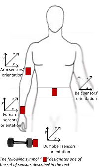

```{r setup, echo=FALSE}
knitr::opts_chunk$set(echo = TRUE)
```

#Introduction
The objective of the project is to create a model which is able to classify the manner in which a unilateral dumbbell bicep curl was performed based on measurements given by three body sensors. 

For the study six participants were asked to perform 10 repetitions of Dumbbell Biceps Curl in five different fashions: 
- exactly according to the specification (Class A), 
- throwing the elbows to the front (Class B), 
- lifting the dumbbell only halfway (Class C), 
- lowering the dumbbell only halfway (Class D) 
- and throwing the hips to the front (Class E).

Class A corresponds to the specified execution of the exercise, while the other 4 classes correspond to common mistakes.

Data for the study was provided by http://groupware.les.inf.puc-rio.br/har 

#Load datasets

First load the training and test data sets and libraries used for analysis.

```{r dataload, cache=TRUE, tidy=TRUE, warning=FALSE}
library(readr);
library(ggplot2)

set.seed(9967)
library(caret)
library(rpart.plot)
library(rattle)

pml_training <- read_csv("https://d396qusza40orc.cloudfront.net/predmachlearn/pml-training.csv", 
     col_types = cols(cvtd_timestamp = col_datetime(format = "%d/%m/%Y %H:%M"), 
         kurtosis_picth_arm = col_number(), 
         kurtosis_picth_belt = col_number(), 
         kurtosis_yaw_arm = col_number(), 
         kurtosis_yaw_belt = col_number(), 
         kurtosis_yaw_dumbbell = col_number(), 
         kurtosis_yaw_forearm = col_number(),
         kurtosis_picth_dumbbell=col_number(),
         kurtosis_roll_arm=col_number(),
         kurtosis_roll_dumbbell=col_number(),
         
         magnet_dumbbell_z=col_number(),
         magnet_forearm_y=col_number(),
         magnet_forearm_z=col_number(),
         amplitude_yaw_dumbbell=col_number(),
         skewness_roll_dumbbell=col_number(),
         max_yaw_dumbbell=col_number(),
         max_yaw_dumbbell=col_number(),
         skewness_pitch_dumbbell=col_number(),
         skewness_roll_arm=col_number(),
         
         skewness_pitch_arm = col_number(), 
         skewness_roll_belt.1 = col_number(), 
         skewness_yaw_arm = col_number(), 
         skewness_yaw_belt = col_number(), 
         skewness_yaw_dumbbell = col_number(), 
         skewness_yaw_forearm = col_number(),
        skewness_roll_belt= col_number(),
        max_yaw_belt= col_number(),
        max_yaw_belt= col_number(),
        min_yaw_dumbbell = col_number(),
        amplitude_yaw_belt= col_number(),
        kurtosis_roll_forearm= col_number(),
        kurtosis_picth_forearm= col_number(),
        skewness_roll_forearm= col_number(),
        skewness_pitch_forearm= col_number(),
        max_yaw_forearm= col_number(),
        max_yaw_forearm= col_number(),
        amplitude_yaw_forearm= col_number(),
        kurtosis_roll_belt= col_number()
         ))

pml_testing <- read_csv("https://d396qusza40orc.cloudfront.net/predmachlearn/pml-testing.csv", 
     col_types = cols(cvtd_timestamp = col_datetime(format = "%d/%m/%Y %H:%M"), 
         kurtosis_picth_arm = col_number(), 
         kurtosis_picth_belt = col_number(), 
         kurtosis_yaw_arm = col_number(), 
         kurtosis_yaw_belt = col_number(), 
         kurtosis_yaw_dumbbell = col_number(), 
         kurtosis_yaw_forearm = col_number(),
         kurtosis_picth_dumbbell=col_number(),
         kurtosis_roll_arm=col_number(),
         kurtosis_roll_dumbbell=col_number(),
         
         magnet_dumbbell_z=col_number(),
         magnet_forearm_y=col_number(),
         magnet_forearm_z=col_number(),
         amplitude_yaw_dumbbell=col_number(),
         skewness_roll_dumbbell=col_number(),
         max_yaw_dumbbell=col_number(),
         max_yaw_dumbbell=col_number(),
         skewness_pitch_dumbbell=col_number(),
         skewness_roll_arm=col_number(),
         
         skewness_pitch_arm = col_number(), 
         skewness_roll_belt.1 = col_number(), 
         skewness_yaw_arm = col_number(), 
         skewness_yaw_belt = col_number(), 
         skewness_yaw_dumbbell = col_number(), 
         skewness_yaw_forearm = col_number(),
         
         skewness_roll_belt= col_number(),
        max_yaw_belt= col_number(),
        max_yaw_belt= col_number(),
        amplitude_yaw_belt= col_number(),
        kurtosis_roll_forearm= col_number(),
        kurtosis_picth_forearm= col_number(),
        skewness_roll_forearm= col_number(),
        skewness_pitch_forearm= col_number(),
        max_yaw_forearm= col_number(),
        max_yaw_forearm= col_number(),
        amplitude_yaw_forearm= col_number(),
        kurtosis_roll_belt= col_number()
         
         )
     
     )

```

#Exploratory data analysis and clean up

Reduce the data set size to make analysis more manageable. This is accomplished by removing zero value columns and removing summary rows which are not part of the test set and therefore can not be used as model features.

```{r cleanup_explore, cache=TRUE, tidy=TRUE}
pml_training<-data.frame(pml_training);

###set factor columns
pml_training$user_name <-factor(pml_training$user_name);
pml_training$classe<-factor(pml_training$classe);
pml_training$new_window<-factor(pml_training$new_window);

###remove zero columns
pml_training<-pml_training[, colSums(pml_training != 0, na.rm = TRUE) > 0]

###create a summary data frame per rep of the exercise, excluding aggregate columns
sm_pml_train<-pml_training[pml_training$new_window=="no",colSums(pml_training[pml_training$new_window=="no",]!=0,na.rm=TRUE)>0];

##Also exclude the time and window number information - not relevant
sm_pml_train<-sm_pml_train[,-c(1,3:7)];

##Take a look at the data
str(sm_pml_train)

``` 

#Features

Features to be included in the model are the measurements from the body sensors:
- belt
- arm
- dumbbell
- forearm



From each sensor the following measures are available:
- roll
- pitch
- yaw
- total accel
- gyros (x, y, z)
- accel (x, y, z)
- magnet (x, y, z)


Thinking through the action of performing a dumbbell curl, it appears that the sensors and movement particularly relevant to Classes would be as follows:
- throwing the elbows to the front (Class B): arm pitch
- lifting the dumbbell only halfway (Class C): forearm pitch
- lowering the dumbbell only halfway (Class D): forearm pitch
- throwing the hips to the front (Class E): belt pitch
- exactly according to the specification (Class A)

So going to focus on measures of pitch first to explore how differ between the classes of dumbell curl. Looking at just a sample of three of the pitch sensors

```{r plot_pitch, cache=TRUE, tidy=TRUE}

p<-ggplot(sm_pml_train, aes(x=classe, y=pitch_forearm, color=user_name)) +
 geom_jitter(shape=16, position=position_jitter(0.2), alpha=0.4)
p

p<-ggplot(sm_pml_train, aes(x=classe, y=pitch_dumbbell, color=user_name)) +
 geom_jitter(shape=16, position=position_jitter(0.2), alpha=0.4)
p

p<-ggplot(sm_pml_train, aes(x=classe, y=pitch_arm, color=user_name)) +
 geom_jitter(shape=16, position=position_jitter(0.2), alpha=0.4)
p

```

It is very evident that the range of measurements is user specific. So the study Will need to model classification per user.

Also need to check if measurements vary over time. Using pitch_forearm to test this, looking at each participant. Including only Adelmo as a representative sample plot.
 
```{r checktime, cache=TRUE, tidy=TRUE}

p<-ggplot(pml_training[pml_training$user_name=="adelmo"&pml_training$new_window=="no",], aes(x=classe, y=pitch_forearm, color=cvtd_timestamp)) +
 geom_jitter(shape=16, position=position_jitter(0.2), alpha=0.4) +
        ggtitle("Adelmo")
p
```
 
Fortunately it appears that the range of measurement for each classe performed does not vary by date. 

#Building the Model

We will be constructing a model per user name in line with exploratory analysis which showed that ranges of measurements per user for each classe are quite different. The predictions of the individual models per user will then be combined to produce an overall prediction for the test set.

I am choosing to build a random forest model for reason of accuracy. One of the drawbacks of this model as I have discovered from experience is that can take a long time to run. The model is constructed by bootstrapping samples and then at each split bootstrapping variables. In this way multiple trees are grown. The final model is consituted by voting on each.

To avoid overfitting clouding the measure of accuracy, the model will be constructed using only the training set. We will perform cross validation by doing prediction on the test set. It is expected that the accuracy of prediction will be lower on the test set for reason of overfitting in model construction.

First we split the train set into train and validation sets. Use Create Data Partition from caret package which does random sampling.

```{r split}
InTrain<-createDataPartition(y=sm_pml_train$classe,p=0.5,list=FALSE)

sm_pml_train<-sm_pml_train[InTrain,]
sm_pml_validat<-sm_pml_train[-InTrain,]

##Split into dataset per user to facilitate processing
adelmo_sm_pml_train<-sm_pml_train[sm_pml_train$user_name=="adelmo",]
carlitos_sm_pml_train<-sm_pml_train[sm_pml_train$user_name=="carlitos",]
charles_sm_pml_train<-sm_pml_train[sm_pml_train$user_name=="charles",]
eurico_sm_pml_train<-sm_pml_train[sm_pml_train$user_name=="eurico",]
jeremy_sm_pml_train<-sm_pml_train[sm_pml_train$user_name=="jeremy",]
pedro_sm_pml_train<-sm_pml_train[sm_pml_train$user_name=="pedro",]

```

Now build models per user on the training set.

```{r training, cache=TRUE, tidy=TRUE}
modAdelmo <- train(classe~ .,data=adelmo_sm_pml_train,method="rf",prox=TRUE)
modAdelmo$finalModel

modCarlitos <- train(classe~ .,data=carlitos_sm_pml_train,method="rf",prox=TRUE)
modCarlitos$finalModel

modCharles <- train(classe~ .,data=charles_sm_pml_train,method="rf",prox=TRUE)
modCharles$finalModel

modEurico <- train(classe~ .,data=eurico_sm_pml_train,method="rf",prox=TRUE)
modEurico$finalModel

modJeremy <- train(classe~ .,data=jeremy_sm_pml_train,method="rf",prox=TRUE)
modJeremy$finalModel

modPedro <- train(classe~ .,data=pedro_sm_pml_train,method="rf",prox=TRUE)
modPedro$finalModel

```

The results per participant (user name) look excellent - less than 1% error on each of the models. However, the actual accuracy of prediction when cross validated on the validation set will be lower than this for reason of overfitting to the training set on which the model was built.

Performing cross validation by predicting on the validation set, then assess accuracy of results using confusion matrix.

```{r crossval}
predAdelmo<-predict(modAdelmo,newdata=sm_pml_validat[sm_pml_validat$user_name=="adelmo", ])
predCarlitos<-predict(modCarlitos,newdata=sm_pml_validat[sm_pml_validat$user_name=="carlitos", ])
predCharles<-predict(modCharles,newdata=sm_pml_validat[sm_pml_validat$user_name=="charles", ])
predEurico<-predict(modEurico,newdata=sm_pml_validat[sm_pml_validat$user_name=="eurico", ])
predJeremy<-predict(modJeremy,newdata=sm_pml_validat[sm_pml_validat$user_name=="jeremy", ])
predPedro<-predict(modPedro,newdata=sm_pml_validat[sm_pml_validat$user_name=="pedro", ])

confusionMatrix(predAdelmo,sm_pml_validat[sm_pml_validat$user_name=="adelmo","classe"])
confusionMatrix(predCarlitos,sm_pml_validat[sm_pml_validat$user_name=="carlitos","classe"])
confusionMatrix(predCharles,sm_pml_validat[sm_pml_validat$user_name=="charles","classe"])
confusionMatrix(predEurico,sm_pml_validat[sm_pml_validat$user_name=="eurico","classe"])
confusionMatrix(predJeremy,sm_pml_validat[sm_pml_validat$user_name=="jeremy","classe"])
confusionMatrix(predPedro,sm_pml_validat[sm_pml_validat$user_name=="pedro","classe"])

```

Surprising 100% accuracy on the validation set. Would have expected a decline.

#Prediction on the test set

Predict on the testing per user name. Then combine the predictions to form a final results.

```{r prediction, cache=TRUE, tidy=TRUE}
predAdelmo<-predict(modAdelmo,newdata=pml_testing[pml_testing$user_name=="adelmo",])
predCarlitos<-predict(modCarlitos,newdata=pml_testing[pml_testing$user_name=="carlitos",])
predCharles<-predict(modCharles,newdata=pml_testing[pml_testing$user_name=="charles",])
predEurico<-predict(modEurico,newdata=pml_testing[pml_testing$user_name=="eurico",])
predJeremy<-predict(modJeremy,newdata=pml_testing[pml_testing$user_name=="jeremy",])
predPedro<-predict(modPedro,newdata=pml_testing[pml_testing$user_name=="pedro",])

df<-data.frame(pml_testing[pml_testing$user_name=="adelmo",c("X1","user_name")],classe=predAdelmo)
df<-rbind(df,data.frame(pml_testing[pml_testing$user_name=="carlitos",c("X1","user_name")],classe=predCarlitos))
df<-rbind(df,data.frame(pml_testing[pml_testing$user_name=="charles",c("X1","user_name")],classe=predCharles))
df<-rbind(df,data.frame(pml_testing[pml_testing$user_name=="eurico",c("X1","user_name")],classe=predEurico))
df<-rbind(df,data.frame(pml_testing[pml_testing$user_name=="jeremy",c("X1","user_name")],classe=predJeremy))
df<-rbind(df,data.frame(pml_testing[pml_testing$user_name=="pedro",c("X1","user_name")],classe=predPedro))
df[order(df$X1),]
```

